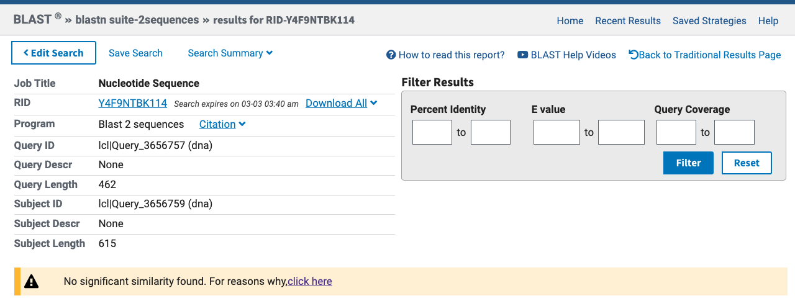
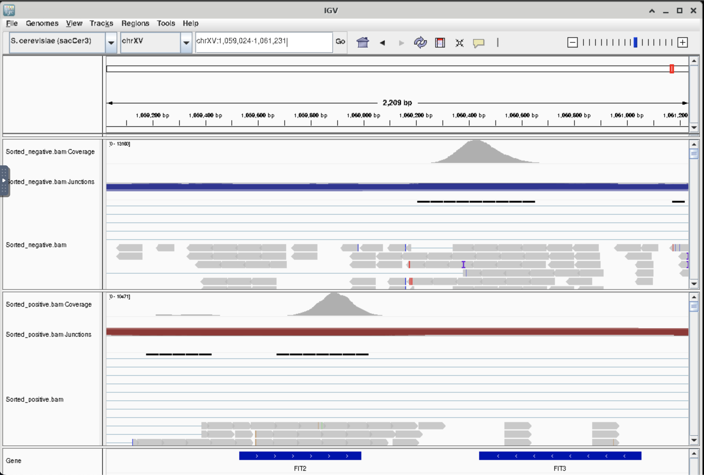

# Load packages

```{r, results='hide', message=FALSE}
#Load packages from CRAN
library(tidyverse)
library(reshape2)
library(ggpubr)
library(biomaRt)
library(readxl)
library(conflicted)
library(ggExtra, lib.loc = "../../R/x86_64-pc-linux-gnu/4.3/")
library(knitr)
library(kableExtra)
library(tidyheatmaps, lib.loc = "../../R/x86_64-pc-linux-gnu/4.3/")

#Solve conflicts
conflict_prefer("select", "dplyr")
conflict_prefer("filter", "dplyr")
conflict_prefer("rename", "dplyr")

```

# Load dataset and filter data 

```{r, results='hide', message=FALSE}
rawdata <- read_tsv("../data/2021_RAPA_TIMECOURSE.tsv.gz") #load raw data
metadata <- read_tsv("../data/Cell_Cycle_Metadata_01112024.tsv.gz") #cell cycle data

#load gene info
ensembl <- useMart(biomart = "ENSEMBL_MART_ENSEMBL",
                   dataset = "scerevisiae_gene_ensembl") 

gen_des <- getBM(attributes = c("ensembl_gene_id",
                                "description",
                                "external_gene_name"),
                 mart = ensembl)

colnames(gen_des) <- c("genes", 
                       "description",
                       "common_name")

rm("ensembl")

```

Do some data wrangling and divide cells into 3 minutes bins.

```{r}
df <- cbind(rawdata, metadata) %>% #merge data and metadata
  filter(Pool %in% c("1", "2")) %>% #timepoints before rapamycin treatment
  filter(Gene %in% "WT") %>% #only wt strain
  drop_na() %>% #remove empty levels
  mutate(max = max(Cell_Cycle_Time), #divide cells in time bins
         min = min(Cell_Cycle_Time),
         width = (max-min)/30,
         bin1 = ceiling((Cell_Cycle_Time - min)/width),
         time_interval = ifelse(Cell_Cycle_Time == min, 
                                bin1 + 1, 
                                bin1),
         time_interval = time_interval * 3) %>% #each bin should reflect minutes
  select(-c("max", "min", "width", "bin1")) %>%
  mutate(time_interval = factor(time_interval))

```

Normalize data

```{r}
df[1:5843] <- df[1:5843]*10000/rowSums(df[1:5843]) #normalize

```

Check how many cells we have in each bin

```{r}
df %>%
  count(time_interval) %>% 
  ggplot(aes(x = time_interval,
                   y = n)) +
  geom_bar(stat = "identity") +
  ylab("#cells")

```

# Intra-cluster analysis and plot regression lines

For each bin, normalize and remove high and low counts. Then calculate mean, sd, and coefficient of variation and build a linear model (coefficient of variation vs mean). Then calculate the residuals, and adjust them based on the mean. In the past we used adjusted residuals, but we decided not to use them here for further plots because when the mean is very low, the adj_res become very high and they 'overpower' more interesting genes with higher residuals. We still calculate them here in case a quick comparison is necessary. 

```{r}
#define lists to store output
model_list <- list()
stats_list <- list()
plot_list <- list()

for (i in 1:length(levels(df$time_interval))) {

  #Create dataframe for specific timepoint
  tmp <- df %>%
    filter(time_interval %in% levels(df$time_interval)[i]) %>%
    select(-c("Gene", "Replicate", "Pool", "Experiment", "Cell_Cycle_Phase",
              "Cell_Cycle_Time", "time_interval")) %>%
    filter(rowSums(.) < 15000) #remove cells with counts above 15000

  #calculate mean, sd, and coefficient of variation
  tmp_stats <- as.data.frame(t( #transpose to make df ggplot friendly
    rbind(mean = apply(tmp, 2, mean, na.rm = T),
          sd = apply(tmp, 2, sd, na.rm = T),
          CV = (apply(tmp, 2, sd))/(apply(tmp, 2, mean, na.rm = T))))) %>%
    filter(mean > 0.01) %>% #remove low expr
    drop_na() #drop empty levels

  #fit the model
  tmp_model <- lm(log10(CV) ~ log10(mean), 
                  data = tmp_stats, 
                  row.names(tmp_stats$genes))

  #calculate residuals for each gene and adjust them
  tmp_residuals <- data.frame(row.names = names(tmp_model$residuals), 
                              residuals = tmp_model$residuals)
                
  tmp_stats <- merge(tmp_stats, 
                     tmp_residuals, 
                     by = "row.names") %>%
    rename("genes" = "Row.names") %>%
    mutate(adj_res = residuals/mean) %>% #adjust residuals
    merge(gen_des, by = "genes") %>%
    distinct() %>% #only keep unique rows
    arrange(desc(adj_res)) %>%
    relocate(common_name, .after = genes)

  #create model plot
  tmp_plot <-
    tmp_stats %>%
    ggplot(aes(x = log10(mean),
             y = log10(CV))) +
    geom_point() +
    geom_abline(slope = coef(tmp_model)[["log10(mean)"]], 
                intercept = coef(tmp_model)[["(Intercept)"]],
                color = "red",
                linewidth = 1) +
    ggtitle(paste0(
      levels(df$time_interval)[i],
      " minutes",
      "_log of x and y, mean > 0.01"))

  #Save oututs
  model_list[[levels(df$time_interval)[i]]] <- tmp_model #save model
  stats_list[[levels(df$time_interval)[i]]] <- data.frame(tmp_stats) #save stats
  plot_list[[levels(df$time_interval)[i]]] <- tmp_plot #save stats
}

rm(list=ls(pattern="^tmp"))

```

Plot the regression lines 

```{r, fig.height=24, fig.width=12}
ggarrange(plotlist = plot_list, ncol=3, nrow =10)

```

# Plot cell cycle genes

As a sanity check, plot the both the non-adjusted and the adjusted residuals of cell cycle genes. Their residuals should be very low since cells are clustered based on time. In the past we used adjusted residuals, but we decided not to use them here for further plots because when the mean is very low, the adj_res become very high and they 'overpower' more interesting genes with higher residuals. We still calculate them here to quickly compare them with the non-adjusted residuals. 

**y scales are different!**

```{r, fig.height=40, fig.width=10}
#import cell cycle annotated genes provided by Chris
cell_cycle_genes <- read_excel("../data/Yeast_Transcriptional_Regulation.xlsx", 
                               sheet = 1) %>%
  rename("Systematic_Name" = "Systematic Name") %>%
  filter(Pathway %in% "Cell Cycle") %>%
  select(c("Pathway", "Systematic_Name", "Gene")) %>%
  filter(Systematic_Name != "#N/A")
cell_cycle_genes <- cell_cycle_genes$Systematic_Name

#plot cell cycle genes
stats_list %>%
  map(~ filter(.x, #only keep genes in the cell_cycle_genes vector
               genes %in% unique(grep(paste(cell_cycle_genes,
                                            collapse="|"),
                                            genes,
                                            value = T)))) %>%
  map2(names(stats_list), ~.x %>% 
         mutate(Time_Point = .y)) %>% #add time column
  bind_rows() %>%
  mutate(Time_Point = as.numeric(Time_Point)) %>%
  select(c("genes", "common_name", "mean", "residuals", "adj_res", "Time_Point")) %>%
  melt(id = c("genes", "common_name", "Time_Point")) %>%
  ggplot(aes(x = Time_Point, #plot
             y = value)) +
  geom_point() +
  scale_x_continuous(breaks = seq(from = 0,
                                  to = 90,
                                  by = 6)) +
  expand_limits(x = 0, y = 0) +
  facet_wrap(common_name ~ variable, 
             scales = "free",
             ncol = 3)
rm("cell_cycle_genes")

```

Check the mean, residuals, and adjusted residuals distributions

```{r, warning=FALSE}
stats_list %>%
  map2(names(stats_list), ~.x %>% 
         mutate(Time_Point = .y)) %>% #add time column
  bind_rows() %>% 
  select(c("genes", "mean", "residuals", "adj_res")) %>%
  melt(id = "genes") %>%
  ggplot(aes(x = value)) +
  geom_density(stat = "density",
               position = "identity") +
    xlim(-2,2) +
    facet_wrap(~variable, 
               scales = "free")
    
```

# Rank combine

First only keep genes common in all time points, then rank the genes in each time bin based on residuals. The lowest rank is assigned to the lowest variable gene in that time bin. Then the ranks for each gene in each time bin are summed together - then extract the genes that rank the highest. These are the genes with the highest variability. Finally we also extract the genes that rank the lowest, which are genes with lowest variability.

```{r, warning=FALSE, message=FALSE}
#calculate rank
rank_combine <- 
  stats_list %>%
  map(~.x %>%
        filter(genes %in% Reduce(intersect, #only keep genes in all timepoints
                                 lapply(stats_list, 
                                        function(x) {
                                          x$genes}))) %>% 
        drop_na() %>%
        mutate(rank = rank(residuals)) %>% #rank based on non-adjusted residuals
        select(c("genes", "common_name", "rank", "description"))) %>%
  map2(names(stats_list), ~.x %>% 
         mutate(Time_Point = .y) %>% #add time column
         mutate(Time_Point = as.numeric(Time_Point))) %>% #convert time to num
  bind_rows() %>%
  group_by(genes, common_name, description) %>% 
  summarise(rank_combined = sum(rank)) %>%
  arrange(desc(rank_combined)) #arrange from highest to lowest

write.csv2(rank_combine, "../results/04_RankCombine.csv", row.names = F)

```

# Plot most variable genes

Extract the most variable genes and plot their mean and residuals. Then do a violin plot of their counts over time. 
\
**Plot mean and residuals for genes with the highest ranks (most variable genes)**
\

```{r, fig.height=60, fig.width=7}
genes_to_plot <- as.character(rank_combine$genes)[3:22] #skips 2 ribosomial genes

stats_list %>%
  map(~ filter(.x, 
               genes %in% unique(grep(paste(genes_to_plot,
                                            collapse="|"),
                                            genes,
                                            value = T)))) %>%
  map2(names(stats_list), ~.x %>% 
         mutate(Time_Point = .y,
                Time_Point = as.numeric(Time_Point))) %>% #add time column
  bind_rows() %>%
  mutate(genes = factor(genes, #sort based on combined residuals
                        levels = genes_to_plot),
         gene = paste(common_name, genes, sep = "|")) %>%
  arrange(match(genes, genes_to_plot)) %>%
  mutate(gene = factor(gene, levels = unique(gene))) %>%
  select(c("gene", "mean", "residuals", "Time_Point")) %>%
  melt(id = c("gene", "Time_Point")) %>%
  ggplot(aes(x = Time_Point, #plot
             y = value)) +
  geom_point() +
    scale_x_continuous(breaks = seq(from = 0,
                                  to = 90,
                                  by = 6)) +
  expand_limits(x = 0, y = 0) +
  facet_wrap(gene ~ variable, 
             scales = "free", 
             ncol = 2)

```

\
**Do violon plot of gene counts for these genes**
\

```{r, fig.height=64, fig.width=10}
df %>%
  select(c(all_of(genes_to_plot))) %>% #select the most variable genes
  cbind(df[5848:5850]) %>% #keep metadata as well
  melt(id = c("Cell_Cycle_Phase", "Cell_Cycle_Time", "time_interval"),
       value.name = "counts",
       variable.name = "genes") %>% #melt for ggplot
  merge(gen_des %>% select(c("genes", "common_name"))) %>% #get common gene name
  mutate(gene = paste(common_name, genes, sep = "|")) %>% #use both genes names
  arrange(match(genes, genes_to_plot)) %>% #arrange genes based on residuals
  mutate(gene = factor(gene, levels = unique(gene))) %>% #convert to levels
  select(c("time_interval","counts","gene")) %>%
  ggplot(aes(x = time_interval,
             y = counts)) +
  geom_violin() +
    facet_wrap(~gene,
             scales = "free",
             ncol = 1)

```

# Plot the least variable genes

\
Plot mean and residuals for genes with the lowest ranks (least variable genes)
\

```{r, fig.height=60, fig.width=7}
genes_to_plot <- as.character(tail(rank_combine$genes, n = 20))

stats_list %>%
  map(~ filter(.x, 
               genes %in% unique(grep(paste(genes_to_plot,
                                            collapse="|"),
                                            genes,
                                            value = T)))) %>%
  map2(names(stats_list), ~.x %>% 
         mutate(Time_Point = .y,
                Time_Point = as.numeric(Time_Point))) %>% #add time column
  bind_rows() %>%
  mutate(genes = factor(genes, #sort based on combined residuals
                        levels = genes_to_plot),
         gene = paste(common_name, genes, sep = "|")) %>%
  arrange(match(genes, genes_to_plot)) %>%
  mutate(gene = factor(gene, levels = unique(gene))) %>%
  select(c("gene", "mean", "residuals", "Time_Point")) %>%
  melt(id = c("gene", "Time_Point")) %>%
  ggplot(aes(x = Time_Point, #plot
             y = value)) +
  geom_point() +
    scale_x_continuous(breaks = seq(from = 0,
                                  to = 90,
                                  by = 6)) +
  expand_limits(x = 0, y = 0) +
  facet_wrap(gene ~ variable, 
             scales = "free", 
             ncol = 2)

```

\
Do violin plot of gene counts for these genes
\

```{r, fig.height=64, fig.width=10}
df %>%
  select(c(all_of(genes_to_plot))) %>% #select the least variable genes
  cbind(df[5848:5850]) %>% #keep metadata as well
  melt(id = c("Cell_Cycle_Phase", "Cell_Cycle_Time", "time_interval"),
       value.name = "counts",
       variable.name = "genes") %>% #melt for ggplot
  merge(gen_des %>% select(c("genes", "common_name"))) %>% #get common gene name
  mutate(gene = paste(common_name, genes, sep = "|")) %>% #use both genes names
  arrange(match(genes, genes_to_plot)) %>% #arrange genes based on residuals
  mutate(gene = factor(gene, levels = unique(gene))) %>% #convert to levels
  select(c("time_interval","counts","gene")) %>%
  ggplot(aes(x = time_interval,
             y = counts)) +
  geom_violin() +
  facet_wrap(~gene,
             scales = "free",
             ncol = 1)

```

# Plot high variability genes next to low variability genes

Trying to plot high variability next to low variability, I noticed that the low variability are generally on way lower scales/counts.

The goal of this is to visualize how gene counts are distributed for high vs low variability genes.

```{r, fig.height=12, fig.width=10}
df %>%
  select(c("YOR383C",  #high var
           "YOR234C", #low var
           "YLR286C", #high var
           "YPL037C", #low var
           "YJL189W", #high var
           "YOR133W") #low var
         ) %>%
  cbind(df[5848:5850]) %>% #keep metadata as well
  melt(id = c("Cell_Cycle_Phase", "Cell_Cycle_Time", "time_interval"),
       value.name = "counts",
       variable.name = "genes") %>% #melt for ggplot
  merge(gen_des %>% select(c("genes", "common_name"))) %>% #get common gene name
  mutate(gene = paste(common_name, genes, sep = "|")) %>% #use both genes names
  mutate(gene = factor(gene, levels = unique(gene))) %>% #convert to levels
  mutate(gene = fct_relevel(gene,
                            c("FIT3|YOR383C",
                              "RPL33B|YOR234C",
                              "CTS1|YLR286C",
                              "EGD1|YPL037C",
                              "RPL39|YJL189W",
                              "EFT1|YOR133W"))) %>%
  select(c("time_interval","counts","gene")) %>%
  ggplot(aes(x = time_interval,
             y = counts)) +
  geom_violin() +
  ggtitle("High variability on the left, low variability on the right") +
  facet_wrap(~gene,
             ncol = 2)

```

# Extract genes with low mean and high residuals 

The most interesting genes are those with a very low mean, so overall low expression, but with high residuals. These genes are lowly expressed in most cells, but in some are highly expressed and thus have high variability. These genes are the most interesting for us. 

\
Plot their mean and residuals
\

```{r, fig.height=40, fig.width=10}
tmp <- stats_list %>%
  map(~ filter(.x, mean < 1)) %>% #keep genes with low counts
  map(~ filter(.x, #keep genes with high rank
               genes %in% unique(grep(paste(rank_combine$genes[1:100],
                                            collapse="|"),
                                            genes,
                                            value = T))))
#need to break the pipe to get the common genes out
common_genes <- Reduce(intersect, #get genes present in all timebins 
                       lapply(tmp, 
                              function(x) {
                                x$genes}))

tmp %>% 
  map(~ filter(.x, #only keep genes in the all timebins
               genes %in% unique(grep(paste(common_genes,
                          collapse="|"),
                          genes,
                          value = T)))) %>%
  map2(names(stats_list), ~.x %>% 
         mutate(Time_Point = .y,
                Time_Point = as.numeric(Time_Point))) %>% #add time column
  bind_rows() %>%
  mutate(genes = factor(genes, #sort based on combined residuals
                        levels = rank_combine$genes[1:100]),
         gene = paste(common_name, genes, sep = "|")) %>%
  arrange(match(genes, rank_combine$genes[1:100])) %>%
  mutate(gene = factor(gene, levels = unique(gene))) %>%
  select(c("gene", "mean", "residuals", "Time_Point")) %>%
  melt(id = c("gene", "Time_Point")) %>%
  ggplot(aes(x = Time_Point, #plot
             y = value)) +
  geom_point() +
    scale_x_continuous(breaks = seq(from = 0,
                                  to = 90,
                                  by = 6)) +
  expand_limits(x = 0, y = 0) +
  facet_wrap(gene ~ variable, 
             scales = "free", 
             ncol = 2)

```

\
Plot their gene counts
\

```{r, fig.height=40, fig.width=10}
df %>%
  select(c(all_of(common_genes))) %>% #select the interesting genes
  cbind(df[5848:5850]) %>% #keep metadata as well
  melt(id = c("Cell_Cycle_Phase", "Cell_Cycle_Time", "time_interval"),
       value.name = "counts",
       variable.name = "genes") %>% #melt for ggplot
  merge(gen_des %>% select(c("genes", "common_name"))) %>% #get common gene name
  mutate(gene = paste(common_name, genes, sep = "|")) %>% #use both genes names
  arrange(match(genes, rank_combine$genes[1:100])) %>% #arrange genes based on residuals
  mutate(gene = factor(gene, levels = unique(gene))) %>% #convert to levels
  select(c("time_interval","counts","gene")) %>%
  ggplot(aes(x = time_interval,
             y = counts)) +
  geom_violin() +
  facet_wrap(~gene,
             scales = "free",
             ncol = 1)

```

# TSL1 and TPS3 genes

David is interested in seeing the distribution of TSL1 and TPS3 genes, so plot their mean and residuals

```{r}
#plot mean expr and residual
stats_list %>%
  map(~ filter(.x, genes %in% c("YML100W", "YMR261C"))) %>%
  map2(names(stats_list), ~.x %>% 
         mutate(Time_Point = .y,
                Time_Point = as.numeric(Time_Point))) %>% #add time column
  bind_rows() %>%
  select(c("common_name", "mean", "residuals", "Time_Point")) %>%
  melt(id = c("common_name", "Time_Point")) %>%
  ggplot(aes(x = Time_Point, #plot
             y = value)) +
  geom_point() +
  scale_x_continuous(breaks = seq(from = 0,
                                  to = 90,
                                  by = 6)) +
  expand_limits(x = 0, y = 0) +
  facet_grid(common_name ~ variable, 
             scales = "free")

```

Plot gene counts

```{r, fig.height=8, fig.width=8}
df %>%
  select(c("YML100W", "YMR261C", "time_interval")) %>% #select the interesting genes
  rename(TSL1_YML100W = YML100W,
         TPS3_YMR261C = YMR261C) %>%
  pivot_longer(cols = !time_interval,
               names_to = "genes") %>%
  ggplot(aes(x = time_interval,
             y = value)) +
  geom_violin() +
  facet_wrap(~genes, ncol = 1)

```

And do a marginal plot

```{r, fig.keep='last', warning=FALSE}
tmp <- df %>%
  select(c("YML100W", "YMR261C")) %>% #select FIT2 and FIT3 genes
  rename(TSL1_YML100W = YML100W,
         TPS3_YMR261C = YMR261C) %>%
  cbind(df[5848:5850]) %>% #keep metadata as well
  ggplot(aes(x = log10(TSL1_YML100W+1),
             y = log10(TPS3_YMR261C+1))) +
  xlab("TSL1_YML100W") +
  ylab("TPS3_YMR261C") +
  ggtitle("Log10 Scale") +
  geom_point()

ggMarginal(tmp, type = "densigram")

```

# Do some of the low mean high residuals genes correlate?

If a gene has high or low expression in a cell, do other genes have the same expression pattern?

\
Calculate a correlation matrix - computer R squared between gene pairs. 

```{r}
#prep the df to work on
tmp <- stats_list %>%
  map(~ filter(.x, mean < 2)) %>% #keep genes with low counts
  map(~ filter(.x, #keep genes with high rank
               genes %in% unique(grep(paste(rank_combine$genes[1:500],
                                            collapse="|"),
                                            genes,
                                            value = T))))

common_genes <- Reduce(intersect, #get genes present in all timebins 
                       lapply(tmp, 
                              function(x) {x$genes}))

tmp <- df %>%
  select(c(all_of(common_genes)))

#load function to calculate R-squared
calc_r_sq <- function(x, y) {
  lm_model <- lm(y ~ x)
  summary(lm_model)$r.squared
}

#create matrix to store R-squared values
rsq_matrix <- matrix(NA, 
                     nrow = ncol(tmp), 
                     ncol = ncol(tmp))

# Loop through combinations of columns and calculate R-squared
for (i in 1:(ncol(tmp) - 1)) {
  for (j in (i + 1):ncol(tmp)) {
    rsq_matrix[i, j] <- calc_r_sq(tmp[[i]], tmp[[j]])
  }
}

#assign col and row manes to matrix
colnames(rsq_matrix) <- common_genes
rownames(rsq_matrix) <- common_genes

```

Visualize the R squared on a heatmap

```{r}
tmp <- rsq_matrix %>%
  as.data.frame %>%
  rownames_to_column(var = 'var1') %>%
  gather(var2, value, -var1) %>%
  mutate(value = round(value, 4)) %>% #express R sequared as %
  filter(value < 1,
         value > 0.02) %>% #remove the genes matching with themselves
  drop_na(value) %>%
  arrange(desc(value))

ggplot(tmp,
       aes(x = var1, 
           y = var2,
           fill = value)) +
  geom_tile() + 
  theme(axis.text.x = element_text(angle = 90, vjust = 0.5, hjust=1))

```

Show the top 10 correlated genes:

```{r}
tmp_matrix <- head(tmp, 10)

tmp_matrix$var1 <- gen_des$common_name[match(tmp_matrix$var1, gen_des$genes)]
tmp_matrix$var2 <- gen_des$common_name[match(tmp_matrix$var2, gen_des$genes)]

tmp_matrix

```

Append these genes to common gene names and include for each gene its description.

```{r}
common_genes <- union(tmp$var1[1:10], 
                      tmp$var2[1:10])

gen_des %>%
  filter(genes %in% common_genes) %>%
  relocate("genes", "common_name", "description") %>% 
  kable %>%
  kable_styling("striped", full_width = T) %>% 
  scroll_box(height = "400px")

```

The gene ASH1 (YKL185W) appears twice in the correlation matrix.

# Plot FIT2 vs FIT3

**Plot FIT2 and FIT3 gene counts on linear and log scale**

\

Fit2 and Fit3 are interesting genes, try to plot their counts against each other to see if they correlate.

```{r, fig.show='hold'}
#plot on linear scale
df %>%
  select(c("YOR382W", "YOR383C")) %>% #select FIT2 and FIT3 genes
  cbind(df[5848:5850]) %>% #keep metadata as well
  ggplot(aes(x = YOR382W,
             y = YOR383C)) +
  xlab("FIT2") +
  ylab("FIT3") +
  ggtitle("Linear Scale") +
  geom_point()

#plot on log scale
df %>%
  select(c("YOR382W", "YOR383C")) %>% #select FIT2 and FIT3 genes
  cbind(df[5848:5850]) %>% #keep metadata as well
  ggplot(aes(x = log10(YOR382W),
             y = log10(YOR383C))) +
  xlab("FIT2") +
  ylab("FIT3") +
  ggtitle("Log10 Scale") +
  geom_point()

```

**Do marginal distribution plot**

\

The zeros make it clear that your data is not negative binomial. The distribution of the log pseudocount plot (log x+1) is a mixture of at least two underlying distributions, because it is not consistent with a single negative binomial distribution. And that mixture argues for heterogeneity, because there's at least two different populations of things with differing underlying properties

```{r, fig.keep='last', warning=FALSE}
tmp <- df %>%
  select(c("YOR382W", "YOR383C")) %>% #select FIT2 and FIT3 genes
  cbind(df[5848:5850]) %>% #keep metadata as well
  ggplot(aes(x = log10(YOR382W+1),
             y = log10(YOR383C+1))) +
  xlab("FIT2") +
  ylab("FIT3") +
  ggtitle("Log10 Scale") +
  geom_point()

ggMarginal(tmp, type = "densigram")

```

**There is no significant sequence similarity between FIT2 and FIT3.**

Blast DNA seq of FIT2 vs DNA seq of FIT3 shows no sequence similarity.

```{r echo= FALSE }



```

**The two genes are facing each other on the genome**, so let's check if their peaks are resolved properly or if they show some overlap.

```{r echo= FALSE }



```
