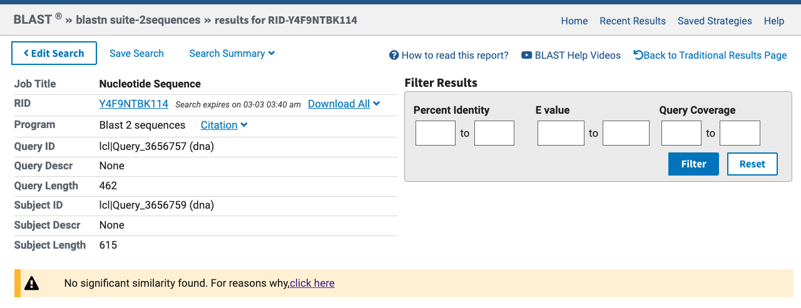

After performing the IntraCluster analysis on the cells before rapamycin treatment, we want to dig deeper in the results. I started a new script since the previous one was getting too long.

Here we want to check if there is any correlation between genes that have low expression levels but high variability (i.e these genes are generally not expressed but when they are expressed they are highly expressed). Specifically we want to see if any of these genes whenever are highly expressed are highly expressed with other similar genes.

We find that FIT2 and FIT3 tend to be both highly expressed whenever are highly expressed. So we try to dig a bit deeper there, and try to rule out any possible artifacts that may have caused this correlation.

# Load packages

```{r, warning=FALSE, message=FALSE}
library(tidyverse)
library(reshape2)
library(gridExtra)
library(ggExtra, lib.loc = "../../R/x86_64-pc-linux-gnu/4.3/")
library(knitr)
library(kableExtra)
library(tidyheatmaps, lib.loc = "../../R/x86_64-pc-linux-gnu/4.3/")
library(conflicted)
source("functions/loadNoRapaTreat.R")
source("functions/readSTARsoloCounts.R")
source("functions/LoadWholeWtDataset.R")

conflict_prefer("select", "dplyr")
conflict_prefer("filter", "dplyr")

#Create directory to save output
if (!dir.exists("../results/IntraCluster_Analysis_FIT2vsFIT3")){
  dir.create("../results/IntraCluster_Analysis_FIT2vsFIT3/")}

```

# Load data

```{r}
df <- loadNoRapaTreat(rawdata_path = "../data/2021_RAPA_TIMECOURSE.tsv.gz",
                      metadata_path = "../data/Cell_Cycle_Metadata_01112024.tsv.gz")

gen_des <- readRDS("../results/Gene_Variance/gensets_and_description.Rds") %>%
  select(-c("gene_Set"))

stats_list <- readRDS("../results/IntraCluster_Analysis/stats_list.Rds")
rank_combine <- readRDS("../results/IntraCluster_Analysis/rank_combine.Rds")

```

# Do some of the low mean high residuals genes correlate?

If a gene has high or low expression in a cell, do other genes have the same expression pattern?

I have the mean of each gene in each timepoint. I use that to calculate the mean across all the time intervals, and filter for genes below a certain mean value (here set at 1). Then, I extract the remaining gene names, and filter the normalized gene counts dataframe only to retain those genes. Then I check if any of those genes correlate with each other (calculate a correlation matrix - compute R squared between gene pairs). 

```{r}
#prep the df to work on
common_genes <- stats_list %>%
  map2(names(stats_list), #merge all lists, adding a column with sampling_point
       ~.x %>%
         mutate(sampling_point = .y)) %>%
  bind_rows() %>%
  group_by(genes) %>% #group by genes and calculate. the overall average expr
  summarise(mean_expr = mean(mean)) %>%
  filter(mean_expr < 1) %>% #keep genes with low counts
  filter(genes %in% unique(grep(paste(rank_combine$genes[1:500], #keep high rank
                                      collapse="|"),
                                genes,
                                value = T))) %>%
  pull(genes)

tmp <- df %>%
  select(c(all_of(common_genes)))

#load function to calculate R-squared
calc_r_sq <- function(x, y) {
  lm_model <- lm(y ~ x)
  summary(lm_model)$r.squared
}

#create matrix to store R-squared values
rsq_matrix <- matrix(NA, 
                     nrow = ncol(tmp), 
                     ncol = ncol(tmp))

# Loop through combinations of columns and calculate R-squared
for (i in 1:(ncol(tmp) - 1)) {
  for (j in (i + 1):ncol(tmp)) {
    rsq_matrix[i, j] <- calc_r_sq(tmp[[i]], tmp[[j]])
  }
}

#assign col and row manes to matrix
colnames(rsq_matrix) <- common_genes
rownames(rsq_matrix) <- common_genes

#save the correlation matrix
saveRDS(rsq_matrix, file = "../results/IntraCluster_Analysis_FIT2vsFIT3/correlation_matrix.Rmd")

```

Visualize the R squared distribution. Filtering for correlations above threshold since most genes have very low correlations and mask on the plot genes with higher correlations.

```{r, fig.show='hold', out.width='50%'}
tmp <- rsq_matrix %>%
  as.data.frame %>%
  rownames_to_column(var = 'var1') %>%
  gather(var2, value, -var1) %>%
  drop_na() %>%
  arrange(desc(value))

tmp %>%
  ggplot(aes(x = value)) +
  geom_density() +
  xlim(-0.01, 0.4) +
  xlab("r squared") + 
  ggtitle("Not filtering for correlations above threshold")

tmp %>%
  filter(value > 0.02) %>%
  ggplot(aes(x = value)) +
  geom_density() +
  xlim(-0.01, 0.4) +
  xlab("r squared") +
  ggtitle("Filtering for correlation above 0.02")

```

Visualize the R squared on a heatmap

```{r}
rsq_matrix[lower.tri(rsq_matrix)] = t(rsq_matrix)[lower.tri(rsq_matrix)]
diag(rsq_matrix) <- 1
heatmap(rsq_matrix)

```

Visualize results on a tidy heatmap

```{r}
tmp %>%
  filter(value < 1) %>% #remove the genes matching with themselves
  drop_na(value) %>%
  arrange(desc(value)) %>%
  ggplot(
       aes(x = var1, 
           y = var2,
           fill = value)) +
  geom_tile() + 
  theme(axis.text.x = element_text(angle = 90, vjust = 0.5, hjust=1),
        axis.title = element_blank())

```

Show the top correlated genes:

```{r}
tmp_matrix <- head(tmp %>% 
                     arrange(desc(value)),
                   20)

tmp_matrix$var1 <- gen_des$gene_name[match(tmp_matrix$var1, gen_des$genes)]
tmp_matrix$var2 <- gen_des$gene_name[match(tmp_matrix$var2, gen_des$genes)]

tmp_matrix

```

Append these genes to common gene names and include for each gene its description.

```{r}
common_genes <- union(unique(tmp$var1[1:15]), 
                      unique(tmp$var2[1:15]))

unique(gen_des %>%
         filter(genes %in% common_genes) %>%
         relocate("genes", "common_name", "description")) %>% 
  kable %>%
  kable_styling("striped", full_width = T) %>% 
  scroll_box(height = "400px")

```

# FIT2 vs FIT3

FIT2 and FIT3 are the genes with the highest correlaiton. We want to dig deeper.

## Plot FIT2 and FIT3 gene counts on linear and log scale

FIT2 and FIT3 are interesting genes, try to plot their counts against each other

```{r, fig.show='hold', out.width='50%'}
rm(list=ls(pattern="^tmp"), common_genes) #clean workspace

#plot on linear scale
df %>%
  select(c("YOR382W", "YOR383C")) %>% #select FIT2 and FIT3 genes
  cbind(df[5848:5850]) %>% #keep metadata as well
  ggplot(aes(x = YOR382W,
             y = YOR383C)) +
  xlab("FIT2") +
  ylab("FIT3") +
  ggtitle("Linear Scale") +
  geom_point()

#plot on log scale
df %>%
  select(c("YOR382W", "YOR383C")) %>% #select FIT2 and FIT3 genes
  cbind(df[5848:5850]) %>% #keep metadata as well
  ggplot(aes(x = log10(YOR382W),
             y = log10(YOR383C))) +
  xlab("FIT2") +
  ylab("FIT3") +
  ggtitle("Log10 Scale") +
  geom_point()

```

**Do marginal distribution plot**

The zeros make it clear that your data is not negative binomial. The distribution of the log pseudocount plot (log x+1) is a mixture of at least two underlying distributions, because it is not consistent with a single negative binomial distribution. And that mixture argues for heterogeneity, because there's at least two different populations of things with differing underlying properties

```{r, fig.keep='last', warning=FALSE}
tmp <- df %>%
  select(c("YOR382W", "YOR383C")) %>% #select FIT2 and FIT3 genes
  cbind(df[5848:5850]) %>% #keep metadata as well
  ggplot(aes(x = log10(YOR382W+1),
             y = log10(YOR383C+1))) +
  xlab("FIT2") +
  ylab("FIT3") +
  ggtitle("Log10 Scale") +
  geom_point()

ggMarginal(tmp, type = "density")

```

## Is there sequence similarity between FIT2 and FIT3?

There is no significant sequence similarity between FIT2 and FIT3.
Blast DNA seq of FIT2 vs DNA seq of FIT3 shows no sequence similarity. 

```{r echo= FALSE }
rm(list=ls(pattern="^tmp"))


```

Do alignement with CLUSTALW as well. 

```{r echo= FALSE }


```

Check also protein seq of FIT2 vs FIT3 on CLUSTALW.

```{r echo= FALSE }


```

## Confirm correlation quantifying gene counts with STARsolo

The two genes are facing each other on the genome. We want to rule out that the correlation we see is an artifact from the aligner we used to quantify the gene counts. Since these counts were quantified with Kallisto which is a pseudoaligner, it is tricky to check where reads aligned in the genome. 

Therefore we quantified the gene counts with STARsolo, checked them on IGV to confirm peaks are separated an do not overlap, and then I checked with the gene counts from STARsolo if FIT2 and FIT3 correlate.

So let's check if their peaks are resolved properly or if they show some overlap after STARsolo alignment. The peaks are clearly separated.

```{r echo= FALSE }

include_graphics("../images_for_rmd/FIT2_FIT3_on_DNA.png")

```

Try to plot FIT2 and FIT3 gene counts quantified with STARsolo instead of Kallisto

```{r}
#direcotry in which the STARsolo output is stored
data.dir = c("../data/STARsolo_counts/RAPA1_filtered/",
             "../data/STARsolo_counts/RAPA2_filtered/",
             "../data/STARsolo_counts/RAPA_REP2_1_filtered/",
             "../data/STARsolo_counts/RAPA_REP2_2_filtered/")

STARsoloData <- list() #where to store the data

#loop through the four directories in which samples are. 
#Load files and normalize the dataset

for (i in 1:length(data.dir)) {
    #load data
    tmp <- readSTARsoloCounts(mtx = file.path(data.dir[i], "matrix.mtx"),
                              cells = file.path(data.dir[i], "barcodes.tsv"),
                              features = file.path(data.dir[i], "features.tsv"),
                              skip.cell = 0,
                              cell.sep = "\t",
                              skip.feature = 0,
                              feature.sep = "\t",
                              cell.column = 1,
                              strip.suffix = FALSE,
                              feature.column = 1,
                              unique.features = TRUE,
                              mtx.transpose = FALSE)
    tmp <- tmp*10000/rowSums(tmp) #normalize data
    STARsoloData[[i]] <- tmp #save data in a list
}

rm(tmp, data.dir)

```

```{r, fig.keep='last'}
tmp <- STARsoloData %>%
  map(~ dplyr::select(., c("YOR382W","YOR383C"))) %>%
  bind_rows()

tmp_plot <- tmp %>%
  ggplot(aes(x=log10(YOR382W+1),
             y=log10(YOR383C+1))) + 
  xlab("FIT2") +
  ylab("FIT3") +
  ggtitle("Log10 Scale, reads quantified with STARsolo") +
  geom_point()

ggMarginal(tmp_plot, type = "density")

```

Calculate correlation between FIT2 and FIT3

```{r}
#create matrix to store R-squared values
tmp_model <- lm(YOR382W ~ YOR383C, data = tmp)

```

The r squared between FIT2 and FIT3 from STARsolo is `r summary(tmp_model)$r.squared`. This is higher than the one calculated with Kallisto, and it might be because here I have more cells. Kallisto is generally more conservative compared to STAR, according to Chris. 
The good thing is that this confirms that FIT2 and FIT3 also correlate when using a different aligner and gene counts quantification algorithm. 

## Do FIT2 and FIT3 correlate in all timepoits of the experiment?

Load the full dataset for the wild type strain. The function loadWholeWtDataset takes care of importing data and metadata, normalizing them, and calculating the timebins for each cell in the dataframe. 

```{r}
df_full <- loadWholeWtDataset(rawdata_path = "../data/2021_RAPA_TIMECOURSE.tsv.gz",
                              metadata_path = "../data/Cell_Cycle_Metadata_01112024.tsv.gz")

#merge sampling point 1 and 2 since they are pre-treatment
df_full$Pool <- str_replace_all(df_full$Pool, c("1" = "2"))

#Filter dataset only to keep relevant cols
tmp <- df_full %>%
  select(c("YOR382W",
           "YOR383C",
           "Pool")) %>%
  mutate(Pool = as.factor(Pool))

```

Plot FIT2 and FIT3 gene counts against each other in every timepoint.

```{r, fig.height=12, fig.width=6}
plots <- list()

for (i in 1:length(unique(levels(tmp$Pool)))) {
  tmp_plot <- tmp %>%
    filter(Pool %in% unique(levels(tmp$Pool))[i]) %>%
    ggplot(aes(x = log10(YOR382W+1),
               y = log10(YOR383C+1))) +
    xlab("FIT2") +
    ylab("FIT3") +
    ggtitle("Log10 Scale") +
    geom_point(alpha = 0.2) +
    ggtitle(paste("Sampling point", unique(levels(tmp$Pool))[i])) +
    theme_minimal()

  plots[[i]] <- ggMarginal(tmp_plot, type = "density")
  

}

grid.arrange(grobs = plots, ncol = 2)

```

Calculate correlation between FIT2 and FIT3 in all timepoints

```{r}
corr_all_timepoints <- data.frame() #save stats here

for (i in 1:length(unique(levels(tmp$Pool)))) {
  tmp_data <- tmp %>% #subset data
    filter(Pool %in% unique(levels(tmp$Pool))[i]) %>%
    drop_na()
  tmp_model <- lm(YOR382W ~ YOR383C, data = tmp_data)
  
  corr_all_timepoints[i, 1:5] <- c(unique(levels(tmp$Pool))[i], #save sampling point
                                   dim(tmp_data)[1], #save number cells in subgroup
                                   sum(tmp_data$YOR382W > 0), #FIT2 counts > 1
                                   sum(tmp_data$YOR383C > 0), # FIT3 counts > 1
                                   round(summary(tmp_model)$r.squared, 4)) #save r squared
  
  }

colnames(corr_all_timepoints) <- c("sampling.point",
                                   "number.of.cells", 
                                   "cells.with.FIT2.counts", 
                                   "cells.with.FIT3.counts", 
                                   "r.squared")

corr_all_timepoints %>%
  kable %>%
  kable_styling("striped", full_width = T)

```

The correlation between FIT2 and FIT3 across sampling points (so later with RAPA tratment) decreases. This is a very interesting result and we'll dig deeper into it.
